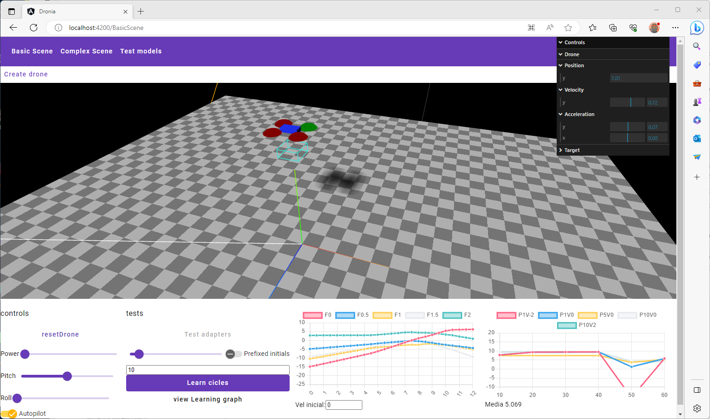

# Dronia 🖋️

This project was generated with [Angular CLI](https://github.com/angular/angular-cli) version 15.2.1. Actualizado a versión 16

El objetivo principal de este proyecto es probar el aprendizaje reforzado en un entorno (pensado básicamente para programadores). Algunas de las cosas para probar, aprender (como programador):

* Usar tensorFlow JS correctamente, junto con typescript y todo lo que significa para usar los tipos correctos de variables (tensores).
* Entender bien que estamos haciendo cuando estamos usando aprendizaje reforzado. Que significa exactamente lo de estados finitos, y como se aproximan recompensas. Ver que cosas pueden funcionar o no.
* Usar Three Js, para poder tener una forma de realimentación visual simple y poder tener gráficos y animaciones que permita ver que ocurre con lo que estamos simulando.
* Indirectamente ir probando/introduciendo buenas prácticas para programar en las últimas versiones de angular.

> ⚠️ Esta misma wiki, se usa como repositorio de notas que se van tomando, no como un documento final, repasado, corregido, etc. con lo que es mas que probable que tenga ideas repetidas, no tan bien redactadas...En algún futuro de vez en cuando se irá repasando la documentación para dejarla mejor.

## Ejemplos

### Entrenamiento simple en 1D

En este caso, lo que se busca es partiendo de un espacio continuo, con las variables posición y velocidad, se quiere realizar un entrenamiento reforzado para que el dron se mantenga estable a cierta altura.
En la red, tenemos 2 entradas, y 5 posibles estados de salida, correspondientes a las posibles acciones a tomar: 5 posibles niveles de potencia.

Para controlar el dron, se obtiene el array de las 5 posibles acciones, y se toma la que tenga la recompensa mayor.

El objetivo de la red, es entonces acabar entrenando el campo recompensa de cada uno de los posibles estados.

👉 Ampliar esto en [mas información detallada](./wiki/aproximacionPrimera.md)

### Entrenamiento simple en 1D version 2

Este caso es una variación del simple, pero en vez de manejar fuerzas deseadas, lo que se maneja es la variación de fuerzas, o sea el control básicamente indica si queremos más o menos fuerza aplicada. Entre las variables de entrada también se incluye la fuerza sentida por el dron (cuando está en reposo, sería de 1 apuntando hacia abajo)

👉 Ampliar esto en [Entrenamiento 1D 2ª versión](./wiki/aproximacionPrimeraB.md)

### Entrenamiento con movimiento en 2D

Se permite que el movimiento sea en 2D, con lo que tenemos control de fuerza y orientación.

👉 Ampliar esto en [Entrenamiento 2D](./wiki/aproximacion2D.md)

#### Jurado para las recompensas

Para valorar la recompensa asignada a un estado, se creó una clase llamada *TReward*. La forma actual para calcular la recompensa, es calcular una posición proyectada, que consiste en la posición actual, a la que se le añade la velocidad. Con esta posición proyectada, entonces se obtiene el valor recompensa de forma lineal y mayor cuanto más cerca se encuentre de la altura objetivo.

#### Problemas encontrados

Es muy importante que los estados iniciales del dron, sean aleatorios tanto en posición como en velocidad, para permitir ir rellenando adecuadamente las posibles recompensas esperadas para cada estado diferente.

La red converge bastante rápidamente hacia el estado que considera mejor, el cual es mantener una fuerza neutra en el dron. Esto se ve en que en los datos obtenidos por la red, se nota la recompensa para el estado neutro, con bastante mas valor que las demás.

Una vez que el dron tiende a mantenerse dentro de los limites pero simplemente quieto, casi sin tendencia a acercase a la altura objetivo, al ir realizando más entrenamientos, se nota como esperado que las recompensas de los demás estados van creciendo también, pero ese proceso es tremendamente largo hasta que el dron aprenda a moverse de esas posiciones de estabilidad hacia la posición deseada.

# Ruta

* Entrenar la red para movimiento en 3D en el espacio
* Manipulación de la red neuronal
  * Persistencia
  * Comprobar si una red entrenada, se puede reusar para otra red ligeramente diferente, y supone alguna ventaja.
* Añadir algoritmos geneticos para mejorar algunas caracteristicas como precisión del aprendizaje, rapidez u optimización de los movimientos para conseguir algo, que simplemente usando recomensas de individuo simple son más dificiles de modelizar.
* Añadir otra red que permita al dron indicar cual es a su vez el target deseado, por ejemplo para poder "planificar" rutas o evitar obstaculos.

# Readme por defecto

Teniendo el entorno con node.js instalado (>=18), y angular (actualmente la v16), se puede descargar el proyecto, y usando visual code, ejecutar directamente sin ninguna otra dependencia especial, ya que están todas incluidas dentro (como cualquier proyecto angular).

### Development server

Run `ng serve` for a dev server. Navigate to `http://localhost:4200/`. The application will automatically reload if you change any of the source files.

### Code scaffolding

Run `ng generate component component-name` to generate a new component. You can also use `ng generate directive|pipe|service|class|guard|interface|enum|module`.

### Build

Run `ng build` to build the project. The build artifacts will be stored in the `dist/` directory.

### Running unit tests

Run `ng test` to execute the unit tests via [Karma](https://karma-runner.github.io).

### Running end-to-end tests

Run `ng e2e` to execute the end-to-end tests via a platform of your choice. To use this command, you need to first add a package that implements end-to-end testing capabilities.

### Further help

To get more help on the Angular CLI use `ng help` or go check out the [Angular CLI Overview and Command Reference](https://angular.io/cli) page.
