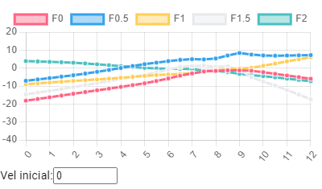
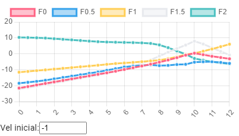
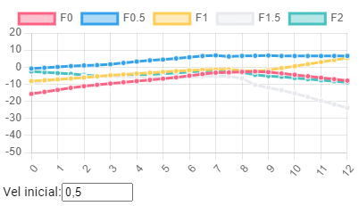

# Primera aproximación

Solo se usa en 1 Dimension (vertical), para poder probar distintas las distintas partes que se necesitan, y poder tener un buen control y visualización de los datos para no entrar en muchas variables que harían dificil el análisis.

En la primera aproximación para resolver el problema, se parte de un sistema con estados continuos como entrada y con un conjunto de estados finito de salida.
Como datos de la entrada, se usa la diferencia en altura con la altura deseada y la velocidad (vertical)

## Estrategia general

Se usa apredizage reforzado, partiendo de estados continuos y queriendo obtener posibles acciones (finitas en la primera versión), con una predicción de recompensa para cada una de ellas, que permita escoger la acción que más recompensa dá para controlar el dron.

En un ciclo de entrenamiento, se realizan 2 partes diferenciadas:

* Ciclo de simulación, en el que en cada paso, con el estado del dron (altura, velocidad), se ejecuta la predicción de la red, y se toma la acción mas favorable. Con el estado nuevo obtenido, se calcula una recompensa, y se guarda en una memoria temporal (solo los n últimos), el estado del dron, que acción se tomó, junto con la recompensa obtenida.
* Ciclo de aprendizaje, en el que se parte de los datos almacenados, y se pasan a la red para su aprendizaje.

En el ciclo de aprendizaje, se tiene una cierta probabilidad pequeña de tomar otro camino, diferente al de mayor recompensa, lo que permite que se puedan explorar otras vías.

En el ciclo de aprendizaje, se usa una variación de la ecuacion de 🤔🤔 en la que la recompensa que se usa para el aprendizaje es la suma ponderada entre la recompensa del paso, y la maxima recompensa esperada de los futuros casos.

> 💡Al acabar un ciclo de simulación, dependiendo si se acabó por tiempo, por salirse de limites o simplemente conseguir el objetivo, se otorga una recompensa adicional, la cual se reparte hacía atrás 

> ⚠️ Es importante remarcar, que solo se modifica la recompensa correspondiente a la acción que se probó, las demas acciones siguen con el valor que tenían, lo que puede reforzar comportamientos no optimos.

## Acciones posibles

Las posibles acciones que se quieren tener en cuenta para saber cual es la siguiente acción, son 5 niveles posibles de potencia (incluyendo el neutro=peso). Se pensó en usar 5 en vez de simplmente 3 para ver si con mas niveles de potencia se podía obtener un ajuste mas fino del control, 

## Recompensas

Para la recompensa, como tiene que ver con la posición y velocidad que tiene en un momento dado, una forma simple, es en un momento, sumamos la posición con la velocidad (escalada), de forma que básicamente se puntua donde estará el vehiculo en el paso siguiente. Con esta posición, simplemente se usa una función cuadrática con la distancia para obtener un valor dado de recompensa.
 
Si el drone se encuentra en un pequeño intervalo de la altura deseada y con una velocidad muy pequeña, entonces se añade a la recompensa otro valor por conseguir el objectivo.

Si se sale de los límites, se añade una penalización.

## Pruebas del concepto

### Gráficas resultado

En todas los siguientes ejemplos, cada gráfica corrresponde con un una fuerza aplicada: Fueza 0, 0.5, 1... y así a lo que corresponden con los 5 posibles estados de salida obtenidos de la red.
En el eje vertical, tenemos para cada punto la recompensa esperada si se toma esa opción. En el eje horizontal, tenemos la altura (recordad que por defecto 6 es el target esperado). Cada conjunto de gráficas, a su vez se entienden que es para una velocidad vertical del dron.

Como estamos reproduciendo las recompensas esperadas, entonces en un estado cualquiera, el dron tomará la acción que le proporcione la mayor recompensa, o sea la que está en la parte superior.

En esta gráfica (tomada después de unos 60 ciclos de entrenamiento), podemos ver que acción tomará el dron según su altura y velocidad inicial 0.
* Si lo posicionamos en la posición 1, vemos que la gráfica que está por arriba es F2 (el doble de fuerza que el peso, lo que hace que suba), la cual da una recompensa esperada sobre 5. 
* Si lo posicionamos en la posición 11, se ve que la acción que tomará es la de usar una potencia baja, lo que hace que el dron baje de posición

---

En está otra gráfica, la velocidad inicial es -1 (hacia abajo).
* Hasta la altura 9, se ve que la acción preferida es usar la potencia 2. Lo que hace que si está por arriba del 6, vaya frenando, y por debajo directamente suba.
* En posiciones un poco mas altas, la fuerza es 1.5, que viene a ser _frenar pero no tanto_.

---

Con una ligera velocidad positiva de 0.5, la acción preferida es directamente tener poca potencia: F0.5, lo que hace que el dron tienda a bajar.

Finalmente cuando se está probando la simulación, lo que ocurre es que el dron va cambiando de estado (equivalente a cambiar en cada momento de gráfica), y lo que ocurre es que va saltando constantemente entre una potencia seleccionada y otra, lo que hace que acabe posicionado en el entorno de la altura deseada de 6.
